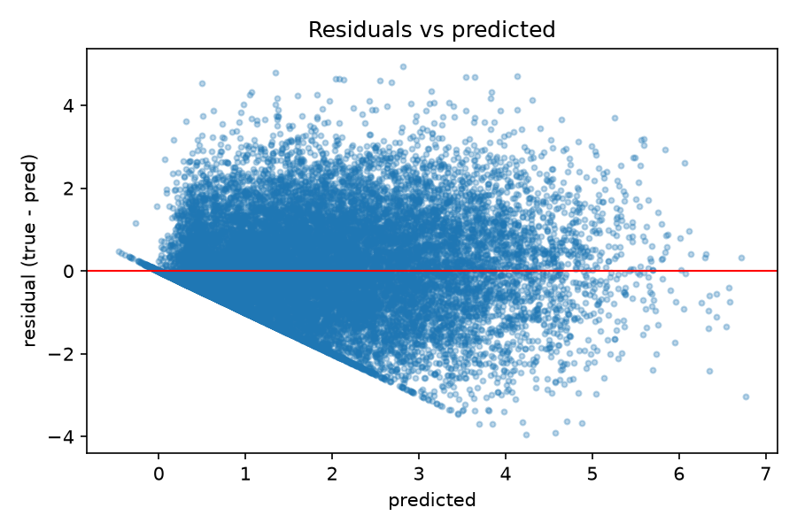

# Student Burnout — Regression

This is the machine-learning part of our group project. The goal is to predict
a student's **burnout score** (a number between 0 and 10) from survey answers
about their lifestyle and studies — sleep, study hours, screen time, exam
pressure, and so on.

It is a **regression** problem: the target is a continuous number, not a class.
So the metrics are RMSE, MAE and R², not accuracy.

The data is **synthetic** — it was generated by a script, not collected from
real students. That is fine for showing the method, but it means the results
are a demonstration of technique, not a finding about real student mental
health. This model is not a diagnostic tool.

---

## What the code does

The project is split into five files. Each one does a single job and hands its
result to the next, so the pipeline is easy to follow from top to bottom.

| File | What it does |
|------|--------------|
| `explore.py` | Loads the data and makes plots: the target distribution, a correlation heatmap, and the strongest predictors. |
| `features.py` | Splits the data (60/20/20), scales the numeric columns and one-hot encodes the text columns, and returns PyTorch DataLoaders. |
| `baselines.py` | Fits simple models (a mean predictor, Ridge regression, RandomForest) as a fair comparison. |
| `model.py` | Defines the neural network (an MLP), trains it with early stopping, and makes predictions. |
| `compare.py` | Runs every model on the same test data, compares them, checks for data leakage, and saves the predictions. |

### The three feature sets

A key idea in this project is that we run the models on **three different sets
of columns**:

- **Set A** — only lifestyle and study variables. This is the honest model.
- **Set B** — Set A plus the psychological scales (stress, anxiety, depression).
- **Set C** — Set B plus `mental_health_index` and `dropout_risk`.

Set C's extra columns were calculated *from* the burnout score when the data was
made. Using them to predict burnout is like measuring something with a copy of
the answer, so a very high score on Set C is a warning sign (data leakage), not
a success. Comparing the three sets is the main point of the analysis.

---

## How to run

The files build on each other, so run them in this order:

```bash
python explore.py      # makes the plots in figures/
python features.py     # checks the data pipeline works
python baselines.py    # simple models
python model.py        # the neural network
python compare.py      # the final comparison + predictions.csv
```

Each file has a small check at the bottom (`if __name__ == "__main__":`) that
runs the code and prints a short summary, so you can see straight away whether
it worked.

The data file `student_mental_health_100k_sample.csv` needs to be in the same
folder. It is a random sample of 100,000 rows drawn from the original million.

---

## Results

### 1. Model comparison (feature set A)

This table comes from running `compare.py`. It shows every model scored on the
**test set** — the part of the data that was never used for training or tuning.

```
         rmse    mae     r2
model                      
mlp     1.115  0.868  0.553
forest  1.145  0.895  0.529
ridge   1.147  0.913  0.527
dummy   1.668  1.381 -0.000
```

**What to say about it:** the neural network (`mlp`) comes out on top, but only
just — Ridge regression is very close behind. On tabular data of this size, a
simple model is often almost as good as a neural network, and reporting that
honestly is more useful than pretending the network is far ahead. The `dummy`
model always predicts the average, so its R² is about 0, which confirms the
setup works.

### 2. Data leakage experiment

The same model (Ridge) run on the three feature sets:

```
                r2
feature_set       
A            0.527
B            0.712
C            0.850
```

**What to say about it:** R² climbs from Set A to Set C. The jump to Set C is
the leakage: the model is partly rebuilding the formula that made the data, not
learning something new about students. This is why those columns are left out of
the honest model.

### 3. Residual plot

`compare.py` saves a residual plot to `figures/residuals.png`. A residual is the
difference between the true value and the prediction.



**What to say about it:** most points scatter around the red zero line, which is
what we want. But there is a clear **diagonal edge at the bottom**: about a
quarter of the burnout scores are exactly 0, because the data generator cut off
negative values at zero. The model can't predict exactly 0, so it always guesses
a bit above — that is the edge.

### 4. Predictions for the dashboard

`compare.py` writes `predictions.csv` with three columns: `id`, `burnout_true`
and `burnout_pred`. This file goes to the dashboard part of the project so the
predictions can be shown next to the survey charts.

---

## Notes and limitations

- **Synthetic data.** The dataset was generated by a script. All results are a
  demonstration of the method, not a claim about real students.
- **The zero floor.** About a quarter of the target is exactly 0 because of
  clipping. A plain regression can't represent that, which the residual plot
  shows. A hurdle model (first predict zero / not-zero, then regress on the
  rest) would handle it better — a possible next step.
- **`academic_year` as a number.** It is treated as a numeric column, which
  assumes the gap between year 1 and 2 is the same as between year 3 and 4. That
  is a simplification, not a fact about the data.
- **No leakage in the pipeline.** The scaler and encoder are fitted on the
  training data only, then applied to validation and test. This stops
  information from the test set sneaking into training.
